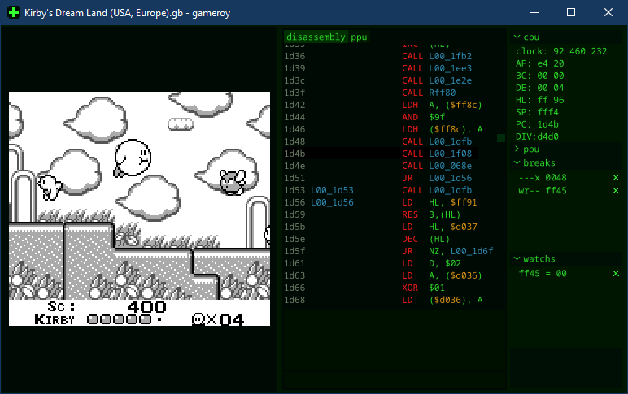

# GameRoy

An emulator and debugger for the Nintendo Game Boy, written in Rust.



## Features

- Support for DMG (only).
- High accuracy (see [Test suite](#test-suite) below)
- Accurate clock frequency: don't sync over frames or sound, but the clock frequency itself.
- Battery saves support.
- Save and load states.
- Time travel backwards in time (Rewind)
- Graphical interface for listing roms in a folder.
- Debugger with a graphical interface:
  - Views for disassembly, registers, video RAM, etc...
  - Statically trace rom for executable memory ranges (and at runtime).
  - Add breakpoints at read, write, jump or execution of memory addresses.
  - Watch addresses.
  - Step code backwards.

## Building and Running

You can find pre compiled binaries in the [Releases page](https://github.com/Rodrigodd/gameroy/releases).

### Native

This project depends on [resvg](https://github.com/RazrFalcon/resvg) (version
0.23, at time of writing) for rendering icons.svg into pngs. You can install it
by running `cargo install resvg`, by downloading it from [resvg Releses
page](https://github.com/RazrFalcon/resvg/releases) or any other way you find.

With resvg installed, you can compile and run a release build of this project
by cloning this repo and running the following command in the project root:

```shell
cargo run --release -p native
```

#### WebAssembly

You can also build for WebAssembly, and run the emulator on the web. Using
[web-pack](https://rustwasm.github.io/wasm-pack/), run the following command:

```shell
wasm-pack build --target web -- --no-default-features --features=static,rfd,audio-engine
```

After that, open a web server in the root folder that serve [index.html].

For example, you can create a server using python `http.server` module:

```
python -m http.server
```

And access `localhost:8000` in a web browser.

### Android

Gameroy uses [Gradle to build the android port](https://developer.android.com/studio/build/building-cmdline).

First you need to create a `local.properties` file under the folder `android`,
with at least your [NDK host tag](https://developer.android.com/ndk/guides/other_build_systems)
name, and maybe other things like the path to your Android SDK, or which target
ABIs to build for, if necessary.

```properties
sdk.dir=/path/to/android-sdk
rust.targets=arm64,arm,linux-x86-64,darwin
hostTag=windows-x86_64
```

Now to build and install the .apk in a device:

```shell
cd android
./gradlew installDebug # or gradlew installDebug, on Windows
```

The project uses
[rust-android-gradle](https://github.com/mozilla/rust-android-gradle) for
building the rust code for android.

## Config

GameRoy uses a file named `gameroy.toml`, located in the same folder as the executable. The default
[`gameroy.toml`](gameroy.toml) file comes documented.

### Controls

The default keymap is:
- `left`: Left Arrow
- `right`: Right Arrow
- `up`: Up Arrow
- `down`: Down Arrow
- `A`: A
- `B`: S
- `select`: Backspace
- `start`: Return

## Debugger

By pressing `F12` you can open/close the debug panel. There you can see a view
to the disassembled code, a view to the ppu memory and state, the cpu
registers, etc. At the bottom there is a text field for command input.

### Debugger commands

- `step` (`F8`): execute 1 opcode.
- `stepback` (`F7`): reverse execute 1 opcode.
- `run` (`F9`): continue to run.
- `run for <clock_count>`: run for the given number of cycles.
- `run until <clock_count>`: run until the total clock count reach the given value.
- `runto <address>`: run until reaching the address.
- `watch <address>`: add a memory address to the watch list, where its value will be displayed.
- `break <flags> <address>`: add a breakpoint to a memory address. Flags is a string containing at
  least one of the following:
  - `x`: break immediately before executing an opcode in the address.
  - `j`: break immediately before jumping to the address.
  - `r`: break immediately before reading the address
  - `w`: break immediately before writing to the address
- `reset`: restart the Game Boy.
- `dump <path>`: write the current disassembled code to a file. This disassembly is not complete
  nor is in a known format.

Pressing `Enter` with the text field empty will run a step.

#### Examples

- `break rw ff45`: break immediately before reading or writing to the LYC register. 
- `break x 0048`: break immediately before executing the STAT Interrupt handler.
- `watch ff05`: watch the value of the TIMA register. 

## Test suite

All test roms used were obtained from [https://github.com/c-sp/gameboy-test-roms/releases/tag/v3.2],
but the emulator was only run against the following tests.

To run the tests, follow the instructions in [core/tests](core/tests/).

### Blargg's tests
                             
| Test           | GameRoy |
|----------------|---------|
| cgb sound      | N/A\*   |
| cpu instrs     | :+1:    |
| dmg sound      | :+1:    |
| instr timing   | :+1:    |
| interrupt time | N/A\*   |
| mem timing     | :+1:    |
| mem timing 2   | :+1:    |
| oam bug        | :x:     |

\* need GBC support. GameRoy only supports DMG.

### Mooneye Test Suite

Only tests that were expected to pass on DMG were tested.

| Test                  | GameRoy |
|-----------------------|---------|
| acceptance\bits       | :+1:    |
| acceptance\instr      | :+1:    |
| acceptance\interrupts | :+1:    |
| acceptance\oam_dma    | :+1:    |
| acceptance\ppu        | :+1:    |
| acceptance\serial     | :+1:    |
| acceptance\timer      | :+1:    |
| acceptance\           | :+1:    |
| emulator_only\mbc1    | :+1:    |
| emulator_only\mbc2    | :+1:    |
| emulator_only\mbc5    | :+1:    |
| other                 | N/A\*   |

\* Not tested.

### Mealybug Tearoom tests

| Test | GameRoy |
|------|---------|
| ppu  | 3/25    |
| mbc  | N/A\*   |
| dma  | N/A\*   |

\* Not tested.

### DMG Acid 2

:+1:

## Resources To Be Thankful For

- [The Ultimate Game Boy Talk (33c3)](https://www.youtube.com/watch?v=HyzD8pNlpwI): great overview of
  the Game Boy and various of it components, including the ppu fifo.
- [Game Boy:tm: CPU Manual](http://marc.rawer.de/Gameboy/Docs/GBCPUman.pdf): used for implement most
  if not all of the opcodes.
- [gb-opcodes](https://gbdev.io/gb-opcodes/optables/): used for opcode reference, and the JSON format
  was very helpful for generating lookup tables and switch cases.
- [Game Boy Complete Technical Reference](https://gekkio.fi/files/gb-docs/gbctr.pdf): used for
  implementing precise memory access timing of instructions.
- [Pan Docs](https://gbdev.io/pandocs/): used for overall reference.
- [GBEDG](https://hacktixme.ga/GBEDG/): used for the implementation of the
  timer, and the initial implementation of the PPU.
- [NightShade's Blog](https://nightshade256.github.io/2021/03/27/gb-sound-emulation.html#fnref:2) and
  [gbdev.gg8.se](https://gbdev.gg8.se/wiki/articles/Gameboy_sound_hardware): used for most of the
  implementation of the sound controller.
- [Same Boys source code](https://github.com/LIJI32/SameBoy): great help for
  the last details of the sound controller, and without it I would never manage
  to implement a cycle accurate PPU.
- And maybe more that I don't remember now.

## License

Licensed under either of

 * Apache License, Version 2.0, ([LICENSE-APACHE](LICENSE-APACHE) or
   http://www.apache.org/licenses/LICENSE-2.0)
 * MIT license ([LICENSE-MIT](LICENSE-MIT) or
   http://opensource.org/licenses/MIT)

at your option.

### Contribution

Unless you explicitly state otherwise, any contribution intentionally submitted
for inclusion in the work by you, as defined in the Apache-2.0 license, shall be
dual licensed as above, without any additional terms or conditions.
